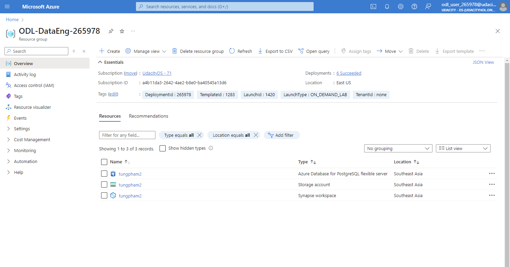
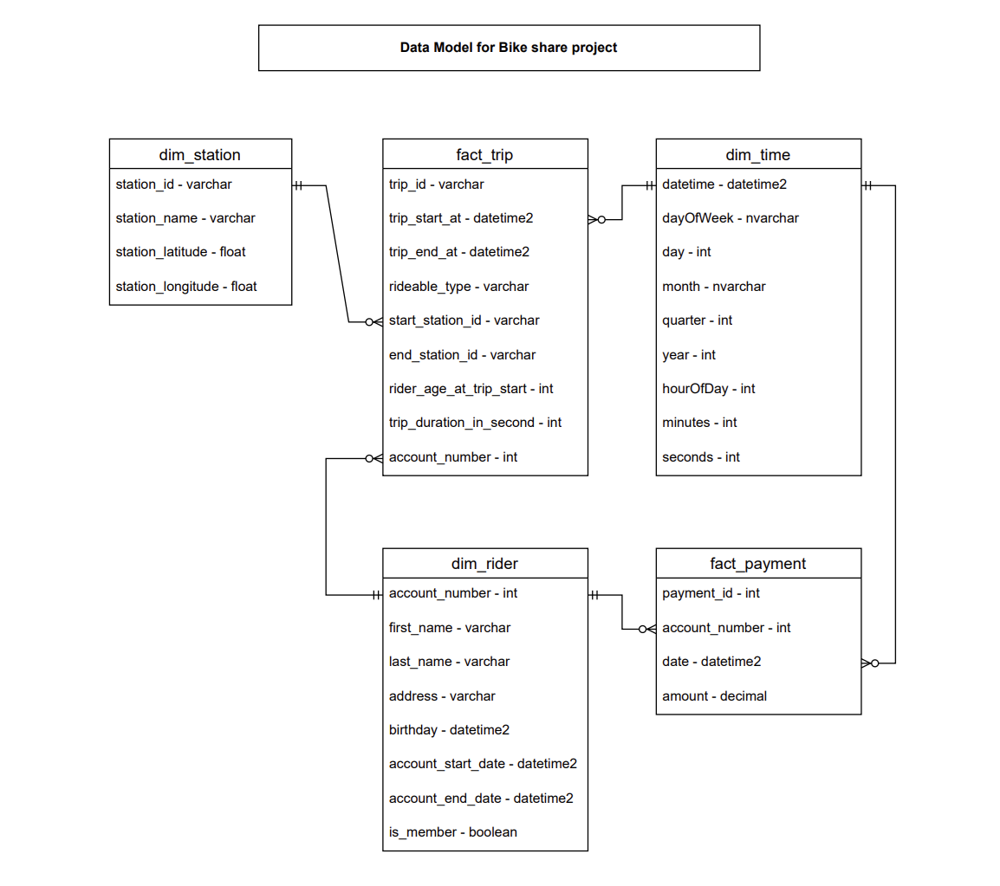
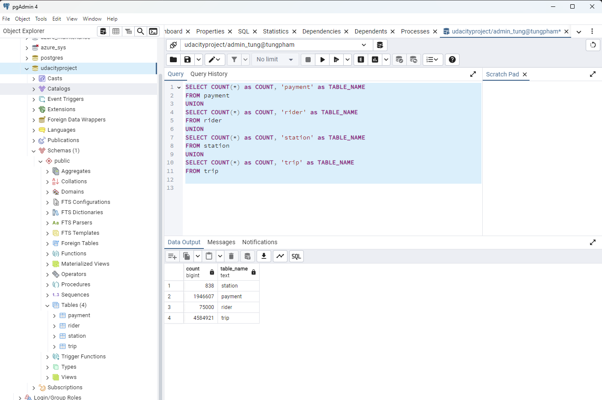
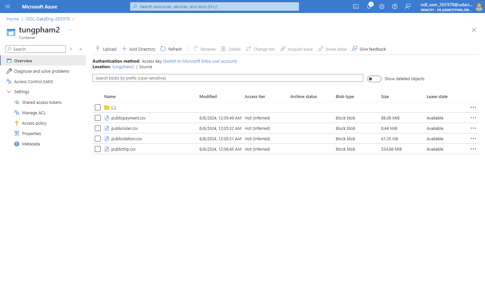
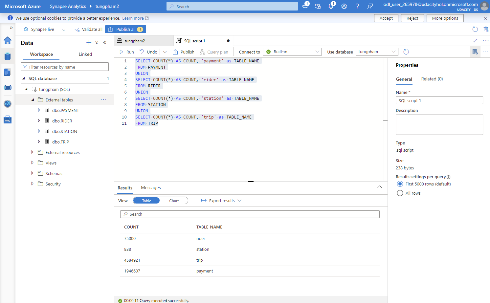
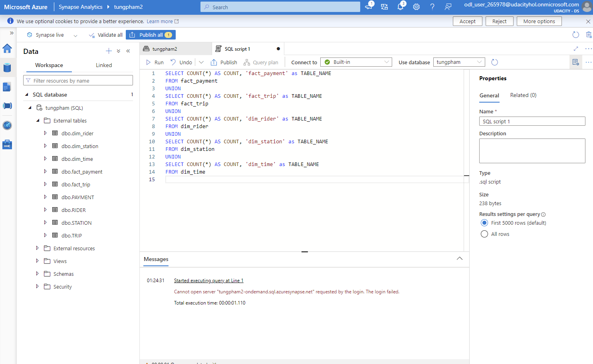

# Cloud Data Warehouses with Azure - Data Engineering

## Project overview

This project focuses on designing and implementing a robust, scalable cloud data warehouse solution on **Microsoft Azure**, specifically utilizing **Azure Synapse Analytics**. The goal is to build an efficient data pipeline and warehouse structure to support analytical queries for bikeshare ride data, transforming raw operational data into actionable insights through a well-defined star schema.

This project was completed as part of the **Udacity Data Engineering with Microsoft Azure Nanodegree Program**.

## Problem statement

A bikeshare company needs to analyze its ride data to understand usage patterns, popular routes, and other key metrics. The raw data is stored in a transactional database (PostgreSQL in this case), which is not optimized for analytical queries. The task is to:
1.  **Design** a star schema tailored for analytical reporting.
2.  **Implement** this schema within Azure Synapse Analytics.
3.  **Build an ELT pipeline** to extract data from the source, load it into Synapse, and transform it into the star schema for efficient querying.

## Key technologies used

* **Microsoft Azure Synapse Analytics:** The central analytics service for data warehousing.
* **Azure Blob Storage:** For staging data during the ELT process.
* **Azure PostgreSQL (simulated/source):** Represents the operational data source.
* **SQL (T-SQL):** For data definition (DDL) and data manipulation (DML) within Synapse.
* **Star Schema Design:** Principles for optimizing analytical queries.

## Project architecture & flow

The project follows an ELT (Extract, Load, Transform) pattern, leveraging Azure services:

1.  **Data Source:** Raw bikeshare ride data (simulated from a PostgreSQL database).
2.  **Staging Area:** Data extracted from PostgreSQL is loaded into Azure Blob Storage.
3.  **External Tables in Synapse:** Data from Blob Storage is exposed as external tables in Azure Synapse Analytics.
4.  **Star Schema Transformation:** Data is transformed from external tables into fact and dimension tables within the dedicated SQL pool of Azure Synapse Analytics using CETAS (CREATE EXTERNAL TABLE AS SELECT) or regular CTAS.
5.  **Analytical Queries:** The star schema is then ready for business intelligence tools and ad-hoc analytical queries.

## Implementation steps & evidence

Below are the key steps undertaken to complete this project, accompanied by screenshots (evidence) from the development process:

### Task 1: Create Azure resources
Setting up the necessary Azure resources, including an Azure Synapse Analytics workspace, storage accounts, and other related services.



### Task 2: Design star schema
Designing the logical and physical star schema for the bikeshare data, identifying fact and dimension tables to optimize analytical queries.



### Task 3: Create data in PostgreSQL (Source)
Simulating the source operational database by creating and populating tables in PostgreSQL.



### Task 4: Extract data from PostgreSQL to Blob Storage
Implementing the extraction process to move raw data from the PostgreSQL source to Azure Blob Storage.



### Task 5: Load data into external tables in DWH
Loading the data from Azure Blob Storage into Azure Synapse Analytics as external tables, making it accessible within the data warehouse.



### Task 6: Transform data into star schema using CETAS
Transforming the data from external tables into the final star schema (fact and dimension tables) within Synapse's dedicated SQL pool, often using CETAS (CREATE EXTERNAL TABLE AS SELECT) for efficient data loading and schema creation.



## How to replicate

To replicate this project:

1.  **Clone the repository:**
    ```bash
    git clone [https://github.com/](https://github.com/)[YOUR_GITHUB_USERNAME]/[YOUR_REPO_NAME].git
    cd [YOUR_REPO_NAME]
    ```
2.  **Azure Account:** You will need an active Azure subscription.
3.  **Azure Resources:** Follow the steps outlined in `task1_CreateAzureResources.png` and the project instructions from Udacity to set up your Azure Synapse Analytics workspace, storage accounts, and other necessary resources.
4.  **Source Data:** Set up a simulated PostgreSQL database or adapt the data loading steps to your preferred source (e.g., directly upload CSV to Blob Storage).
5.  **Execute SQL/Notebooks:** Follow the logical flow of the tasks (as documented in `task1` through `task6`) to execute the necessary SQL scripts within Azure Synapse Analytics to create tables, load data, and perform transformations.

## Learning outcomes

Through this project, I gained practical experience in:
* Designing robust star schemas for analytical workloads.
* Implementing scalable data warehouses using Azure Synapse Analytics.
* Developing ELT pipelines on the Azure platform.
* Working with external tables and optimizing data loading in Synapse.
* Understanding the principles of cloud data warehousing and its advantages.

## Future improvements

* Integrate with Azure Data Factory for automated ELT orchestration.
* Implement incremental data loading strategies.
* Explore performance tuning techniques for Synapse Analytics (e.g., materialized views, indexing).
* Connect the data warehouse to a BI tool like Power BI for dashboarding.

## Contributing

Feel free to fork this repository, submit pull requests, or open issues if you have suggestions or find bugs.
